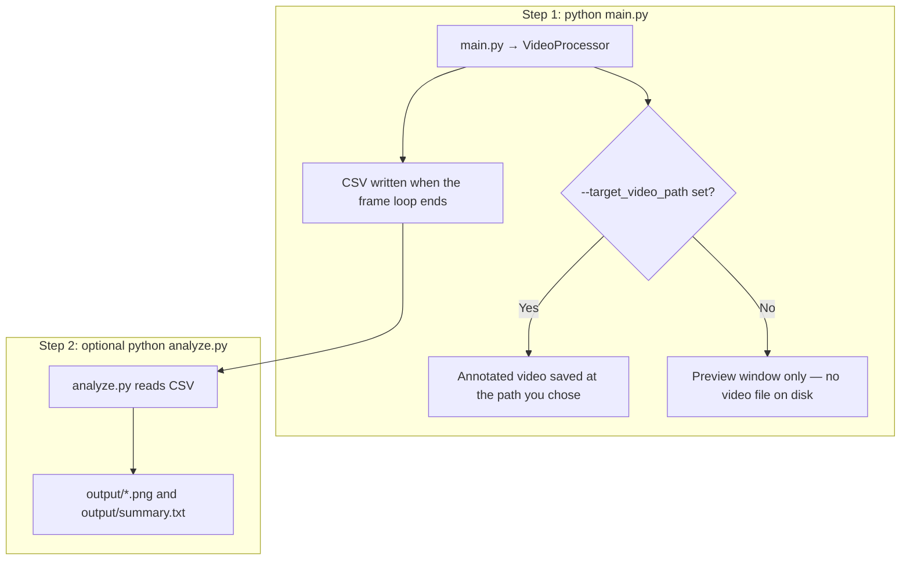

# Traffic analysis with YOLOv8 and ByteTrack

This project analyzes traffic at a four-way intersection using **Ultralytics YOLOv8** for detection and **Supervision**’s **ByteTrack** integration for multi-object tracking. Processing lives under `video_processing/`.

## Quick start: where to run, and what runs automatically

**Where:** Open a terminal in the **repository root** — the folder that contains `main.py`, `analyze.py`, and `requirements.txt`. Paths you pass on the command line are usually relative to that folder (for example `data/traffic_analysis.mov`), or you can use absolute paths.

**Two separate programs (this is the main source of confusion):**

| Step | Command | What it does |
|------|---------|----------------|
| **1 — Pipeline** | `python main.py ...` | Runs YOLO + tracking on the video. Optionally **writes an annotated video file** if you pass `--target_video_path`. When processing **finishes** (full file, or you press `q` in preview mode), it **always writes the CSV** of completed crossings. |
| **2 — Plots (optional)** | `python analyze.py ...` | Does **not** run automatically. Reads the CSV with pandas/matplotlib only and writes **charts and a text summary** under `output/`. Run this **after** step 1 when you want figures for a report or thesis. |

`main.py` never imports or calls `analyze.py`. If you only run `main.py`, you get the video (if requested) and the CSV — no PNGs until you run `analyze.py`.



**Output names (defaults and who chooses them):**

- **Annotated video:** There is **no default filename**. If you omit `--target_video_path`, nothing is saved to disk — you only get a live preview. If you pass `--target_video_path data/my_run.mov`, the file is created at exactly that path (any extension your OpenCV build supports for writing, for example `.mov` or `.mp4`).
- **CSV:** Default is **`results.csv` in the current working directory** (again: the folder where your terminal was when you ran the command). Override with `--results_csv_path path/to/file.csv`.
- **Charts / summary:** Produced only by `analyze.py`, default folder **`output/`** next to the CSV (override with `--out-dir`). Typical files: `speed_distribution.png`, `vehicles_per_minute.png`, `entry_exit_flow_heatmap.png`, `summary.txt`, and optionally `speed_by_class.png` if the CSV includes a vehicle-class column.

**Typical first run:** install dependencies, download sample data (see below), then from the repo root run `main.py` with weights and video paths, then optionally `python analyze.py`.

## What it does

1. **Vehicle detection and tracking** — Bounding boxes colored per track; short motion **traces** behind each vehicle.
2. **Entry / exit zones** — Four **IN** polygons (approach) and four **OUT** polygons (departure), labeled North / South / West / East in `video_processing/utils.py`. Zone colors reflect entry side; counts show how many vehicles from each entry took each exit.
3. **Speed labels** — Estimated speed (km/h) is updated on a fixed frame interval and shown on each track (pixel-based scale; tune `scale` in `video_processing/video_processor.py` for your scene).
4. **Congestion signal** — When the number of **unique** tracked vehicles inside any IN zone exceeds `--congestion_vehicle_threshold`, the UI marks **HIGH** congestion and adjusts IN-zone styling.
5. **HUD** — On-screen totals for vehicles seen entering (**Total IN**) and those that completed at least one IN→OUT path (**Total OUT**).
6. **CSV export** — After a run, writes per completed crossing: timestamp, tracker id, entry side, exit side, estimated speed (`--results_csv_path`, default `results.csv`).
7. **Post-processing analysis** — Optional script `analyze.py` (pandas + matplotlib only, no YOLO) reads the CSV after a run and writes figures plus a text summary under `output/` for reporting or a thesis (speed histogram, vehicles per minute, entry-exit heatmap, optional speed-by-class chart if the CSV includes a class column).

## Repository layout

| Path | Role |
|------|------|
| `main.py` | CLI entrypoint |
| `video_processing/video_processor.py` | YOLO inference, tracking, annotation, video sink or preview |
| `video_processing/detections_manager.py` | Zone logic, speeds, trip completion, CSV writer |
| `video_processing/utils.py` | Zone polygons, colors, zone labels |
| `requirements.txt` | Python dependencies |
| `analyze.py` | Post-process `results.csv`: plots + `summary.txt` in `output/` |
| `setup.sh` | Bash script: creates `data/` and downloads sample video + weights via `gdown` |

Intersection polygons in `utils.py` are hard-coded for the sample resolution; if you use another video, adjust those coordinates.

## Requirements

- Python 3.10+ recommended (project tested with 3.12 on Windows).
- Install dependencies:

```bash
pip install -r requirements.txt
```

Dependencies include `ultralytics`, `supervision>=0.24.0`, `tqdm`, `gdown`, `inference`, `pandas`, and `matplotlib` (as listed in `requirements.txt`).

## Sample data (weights + video)

**Linux / macOS / Git Bash on Windows:**

```bash
chmod +x setup.sh
./setup.sh
```

**Windows (PowerShell)** — run the same downloads manually if you do not use Bash:

```powershell
New-Item -ItemType Directory -Force -Path data | Out-Null
gdown -O "data/traffic_analysis.mov" "https://drive.google.com/uc?id=1qadBd7lgpediafCpL_yedGjQPk-FLK-W"
gdown -O "data/traffic_analysis.pt" "https://drive.google.com/uc?id=1y-IfToCjRXa3ZdC1JpnKRopC7mcQW-5z"
```

Place any other `.pt` / video paths you prefer; the CLI only needs valid file paths.

## How to run

All examples assume your **current working directory** is the repository root (the folder containing `main.py`).

**Write an annotated video** (recommended for long clips):

```bash
python main.py ^
  --source_weights_path data/traffic_analysis.pt ^
  --source_video_path data/traffic_analysis.mov ^
  --target_video_path data/traffic_analysis_result.mov ^
  --results_csv_path results.csv ^
  --confidence_threshold 0.3 ^
  --iou_threshold 0.7 ^
  --congestion_vehicle_threshold 5
```

On bash, use line continuation with `\` instead of `^`.

**Preview in a window** (no output file): omit `--target_video_path`. Press `q` to stop early or let the video finish; in either case the CSV is written when the loop exits (implementation uses a `finally` block so normal completion and closing preview both flush the CSV).

### Post-processing (`analyze.py`)

This is a **second command**, not part of `main.py`. Run it **after** the pipeline has produced `results.csv` (or pass `--csv` to point at another file). It does not load YOLO or Supervision; it only uses **pandas** and **matplotlib**.

```bash
python analyze.py
```

Defaults: read `results.csv`, write under `output/`. Custom paths:

```bash
python analyze.py --csv path/to/results.csv --out-dir path/to/output
```

**Outputs** (PNG files are suitable to drop into a document):

| File | Description |
|------|-------------|
| `output/speed_distribution.png` | Histogram of estimated speed (km/h) with mean / median |
| `output/vehicles_per_minute.png` | Crossing counts per 1-minute window vs. time from start |
| `output/entry_exit_flow_heatmap.png` | 4×4 North/South/East/West origin-destination matrix |
| `output/speed_by_class.png` | Only if the CSV has a class column (`vehicle_class`, `class_name`, `class`, or `yolo_class`) |
| `output/summary.txt` | Totals, average speed, busiest entry, most common route, peak minute (also printed to the console) |

### CLI reference

| Argument | Default | Description |
|----------|---------|-------------|
| `--source_weights_path` | *(required)* | Path to YOLO weights (`.pt`) |
| `--source_video_path` | *(required)* | Input video path |
| `--target_video_path` | `None` | Output video; if omitted, OpenCV preview is used |
| `--results_csv_path` | `results.csv` | Output CSV for completed IN→OUT trips |
| `--confidence_threshold` | `0.3` | Detection confidence |
| `--iou_threshold` | `0.7` | NMS IoU threshold |
| `--congestion_vehicle_threshold` | `5` | Congestion when unique vehicles in IN zones is **strictly greater** than this value |

## Credits / upstream

Original demo and ideas are preserved from the upstream traffic-analysis workflow; this tree uses a current **Supervision** `PolygonZone` API and adds congestion reporting, HUD totals, CSV export, and optional CSV post-processing plots (`analyze.py`).
